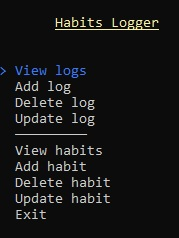
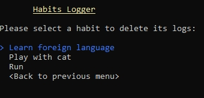
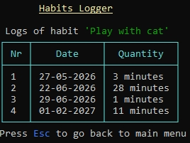

# HabitsLogger

Application to manage entries in local Sqlite-database to track activities of some habit.
It allows also to create / update / view and delete of habits itself. This solution was made as a study project for ['C# Academy'](https://www.thecsharpacademy.com/project/12/habit-logger)

# Requirements to fulfill:

* This is an application where you’ll log occurrences of a habit.
* This habit can't be tracked by time (ex. hours of sleep), only by quantity (ex. number of water glasses a day).
* Users need to be able to input the date of the occurrence of the habit.
* The application should store and retrieve data from a real database.
* When the application starts, it should create a sqlite database, if one isn’t present.
* It should also create a table in the database, where the habit will be logged.
* The users should be able to insert, delete, update and view their logged habit.
* You should handle all possible errors so that the application never crashes.
* You can only interact with the database using ADO.NET. You can’t use mappers such as Entity Framework or Dapper.
* Follow the DRY Principle, and avoid code repetition.
* Your project needs to contain a Read Me file where you'll explain how your app works and tell a little bit about your thought progress. What was hard? What was easy? What have you learned?

# Additional requirements and challenges:

* To improve the user's experience, when asking for a date input, give the option to type a simple command to add today's date.
* Try using parameterized queries to make your application more secure.
* Let the users create their own habits to track. That will require that you let them choose the unit of measurement of each habit. **Hot tip: You should not create a table for each habit**.
* Seed Data into the database automatically when the database gets created for the first time, generating a few habits and inserting a hundred records with randomly generated values. This is specially helpful during development so you don't have to reinsert data every time you create the database. 
* If you already have a bit of experience with programming, we highly recommend you get into the habit of writing unit tests  for a few methods in your project. Any method that outputs data and doesn't talk to a database (those are tested in integration tests) can be unit tested. A good example is any method that deals with validation. 
* Using Azure's Language Services to append AI functionality.

The last two additional challenges was not fulfilled: i have some expirience in programming, but not big fan of unit tests and TDD itself. For using Azure functions one need to have subscription, which is not completely free. Not an option for just a simple study project. All others requirements 
should be more or less covered in provided solution.

# Features

* A console based application with pseudo grafic to display menus and provide way to navigate through it:  

* By first run the program checks if there is an empty database to track records. If there is no such database, then in a folder with exe-file will be created log.db-file to store all user's data.
The user will be asked, if the newly created database should be populated with some random datas.

* The data will be stored in two tables - 'habits' (all habits) and 'log' (all logs of all habits). The tables are connected through habits-Id.

* Application supports all CRUD operations. By reading from logs or by inserting, updating and deleting will be firstly display a list of habits, which data should be updated:  
.

* Existing data will be displayed in tabular form:  

* Program supports navigation through table to delete or update records in database.

* User can any time go back to main menu and exit the application.

* Each change in data will be immediately saved in database.

# Conslusion

* The task was not really challenging, because i have some knowledge in C# and SQL (but not in Sqlite).

* Interfaces of Sqlite from Microsoft looks very similar like to interfaces of C#-class 'SqlDataReader'. It's very convenient and easy to use.

* Prior i have no knowledge in parametrized sql queries. Yet i know mordate a view of single table's cell one schould redraw completes table on screen. It's not convenient.
Nevertheless the library is good and i can recommend it to use. 

# Resources Usede and i like it :)

* Library 'Spectre' is good for displaing menus and tables, but also is not perfect yet (or most likely i don't use it properly).
For instance there is no possibility to shift menu or table by specific distance from left edge of console window - i can say "align my table to left/right/center" but not 
"make offset of two spaces from left and then draw a table". Also to up

Lesson from ['C# Academy'](https://www.thecsharpacademy.com/project/12/habit-logger), advises from StackOevrflow and from other internet sites.
The application was created completely without using of AI-junk :)